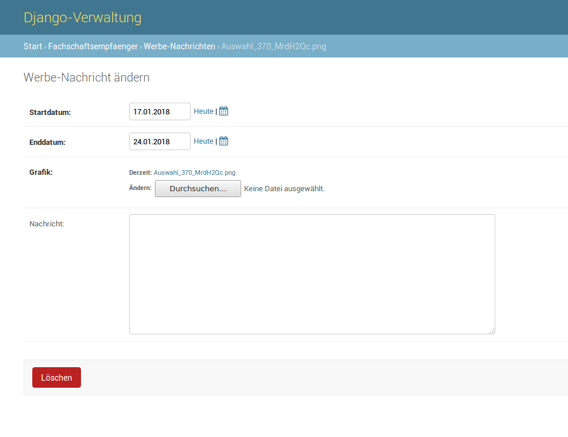
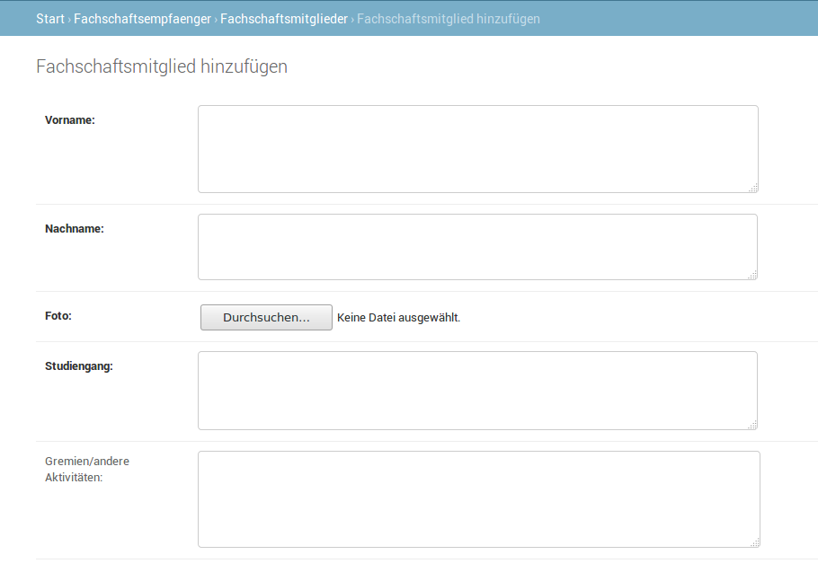
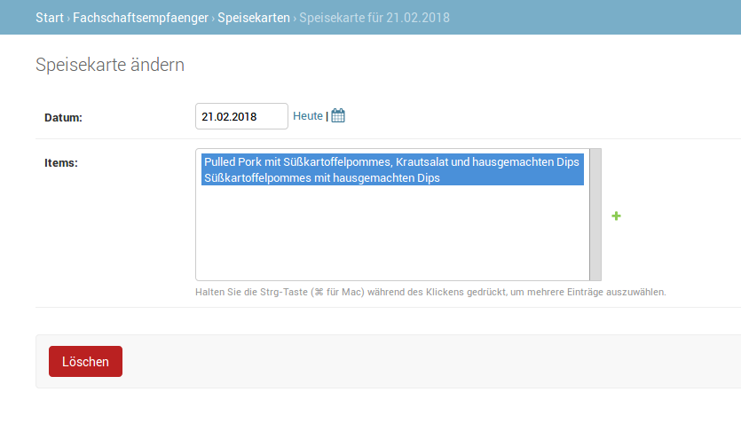

Administration
==============
The content of some tiles can be changed via the Django admin. Once a user with
``staff`` privileges is created, the Django admin can be accessed under ``/admin``.
The appearance of these ``ModelAdmin`` classes can be changed under ``admin.py``.

Advertisements
--------------
An advertisement consists of an image and an optional text. This way, one can
put images of flyers, posters etc. into this tile to advertise for events
of the local student union. Each ad has a start and end date to mark the duration
in which the ad should be displayed.

Once you upload a number of ad images, one will be chosen at random each time
the tile is reloaded. This behaviour can be changed by adjusting the *QuerySet*
inside the ``advertisement_tile`` view inside ``views.py``:

.. code-block:: python

  qs = Advertisement.objects.filter(start_date__gte=timezone.now()).order_by('?').first()

Student Union Members
---------------------
So students can get to know their student union members better, you can display
members of the local student union with the following details:

- first and last name
- field of study
- a profile picture (optional)
- extracurricular activities (optional)

If no image is provided for the profile picture, a placeholder image is displayed instead. This image
can be changed by replacing the file ``no_pic.png`` within the ``uploads`` directory.

Food Truck / Catering
---------------------
In case there is a form of local catering besides the mensa (i.e. a food truck),
you can display the daily/weekly menu by entering the dishes and assigning them
to a menu. A menu consists of a date and multiple menu items.  A menu item consists of
the name of the dish, the price and a boolean that indicates wether the dish is vegan or not.

As a default, this tile displays one menu per week. This can be changed by altering
the ``QuerySet``. It is located inside the ``foodtruck_tile`` view inside ``views.py``:

.. code-block:: python

  menu_date = Menu.objects.get(date__gte=timezone.now(), date__lte=timezone.now() + datetime.timedelta(days=6)).date.strftime("%d.%m.%Y")
  menu = Food.objects.filter(menu_item__date__gte=timezone.now(), menu_item__date__lte=timezone.now() + datetime.timedelta(days=6))

Here, ``menu_date`` returns the date to be displayed above the menu,
whereas ``menu`` is the menu itself. If you wanted to display the menu for the current day,
you could change the QuerySet to something like

.. code-block:: python

  menu = Food.objects.filter(menu__item__date=timezone.now().today())
